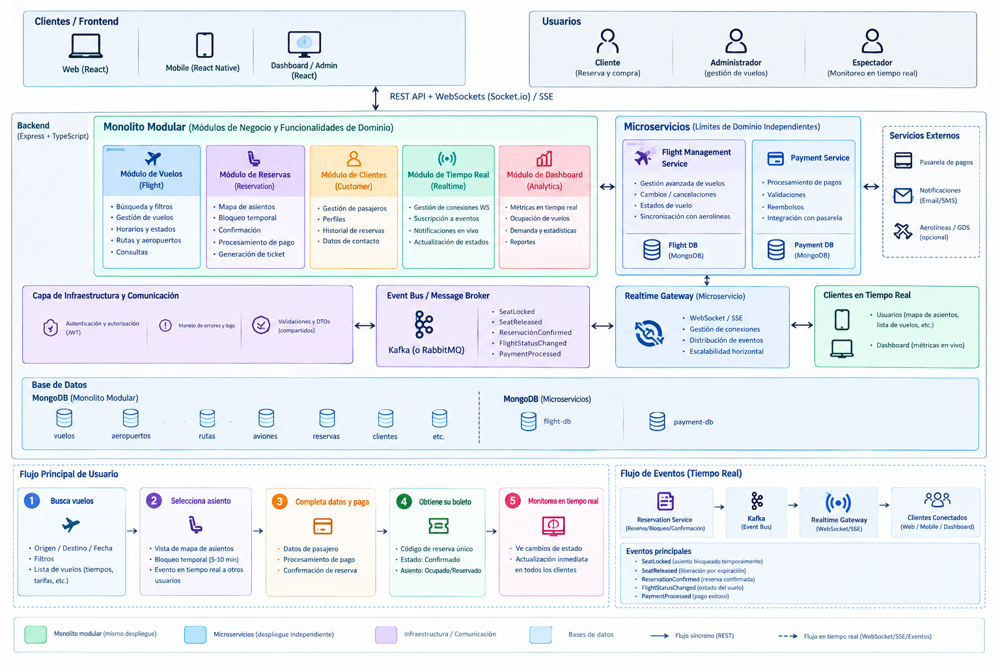

# Sistema de Reservas de Vuelos en Tiempo Real

Prototipo funcional (prueba técnica Full Stack Senior) de un sistema de reservas para una aerolínea. Permite
**buscar vuelos**, ver el **mapa de asientos en tiempo real**, **bloquear un asiento temporalmente** (7 min, configurable entre 5 y 10)
mientras se paga, **confirmar el pasaje** con un código de reserva único y **monitorear la ocupación** en un dashboard en vivo.

El reto principal es la concurrencia. Cuando un usuario bloquea o compra un asiento, todos los usuarios conectados ven el cambio
al instante y **nunca se vende el mismo asiento dos veces** (sin *double booking*).

---

## 1. Resumen del proyecto

| Historia de usuario | Qué resuelve | Regla de tiempo real |
|---|---|---|
| HU1 · Búsqueda y filtro de vuelos | Vuelos por origen, destino y fecha, con tarifas, horarios y disponibilidad | Los cambios de estado (retrasado, cancelado, agotado) llegan a la lista de resultados sin recargar |
| HU2 · Selección y bloqueo temporal | Mapa interactivo y bloqueo del asiento de 5 a 10 min | Al bloquear, los demás usuarios reciben `seat:locked`; al vencer el tiempo, `seat:released` |
| HU3 · Confirmación y pago | Pago con datos ficticios y boleto con código único (PNR) | El asiento pasa a ocupado y se emite un evento global que lo deshabilita para todos |
| HU4 · Dashboard del vuelo | Métricas de ocupación: disponibles, bloqueados y ocupados | Reacciona al instante a cada bloqueo, liberación por expiración y reserva confirmada |

**Stack:** Node.js 22 · Express · TypeScript · MongoDB + Mongoose · Kafka (KafkaJS) · Socket.io · SSE · RxJS · Zod · JWT · Jest · Docker.

### Estructura del repositorio

```
├─ arquitectura/                 Diagrama de arquitectura
├─ backend/
│  ├─ PruebaTecnicaSistemaReservasVuelosTiempoReal_Backend   Monolito modular      :3000
│  ├─ PruebaTecnicaSistemaReservasVuelosTiempoReal_FMS       Flight Management Svc :3001
│  ├─ PruebaTecnicaSistemaReservasVuelosTiempoReal_PS        Payment Service       :3002
│  ├─ PruebaTecnicaSistemaReservasVuelosTiempoReal_RG        Realtime Gateway      :4000
│  ├─ shared-kernel/             Núcleo técnico común (JWT, errores, logs, Kafka, SSE, Express)
│  ├─ infra/                     Kafka + MongoDB + Kafka UI (docker compose) y script de creación de BD
│  ├─ integration-tests/         Prueba del flujo completo con los 4 servicios
│  ├─ docker-compose.yml         Despliegue local completo
│  └─ requests.http              Colección de peticiones del flujo principal
├─ cliente/shared/               DTOs, eventos y validaciones compartidas frontend ↔ backend
├─ compartidas/docs/             Documentación detallada
└─ frontend/                     Frontend React (web + dashboard/admin)   :5173 dev / :8080 Docker
```

---

## 2. Ejecución local

### Requisitos

- **Docker Desktop 4.22 o superior** (usa `include` de Compose), con al menos 6 GB de RAM asignados.
- Opcional, para ejecutar sin contenedores o correr las pruebas: **Node.js 22** y npm 10.

### Opción A: todo con Docker (recomendada)

```bash
git clone https://github.com/jgaleano2018/PruebaTecnicaSistemaReservasVuelosTiempoReal.git
cd PruebaTecnicaSistemaReservasVuelosTiempoReal/backend
docker compose up -d --build        # Kafka, MongoDB, Kafka UI, monolito, 3 microservicios y frontend
docker compose ps                   # esperar a que todo esté "healthy"
docker compose logs -f monolith     # la primera vez crea las bases y carga la data inicial
```

| Servicio | URL |
|---|---|
| Monolito modular (API) | http://localhost:3000/api/v1 · salud: http://localhost:3000/health |
| Flight Management Service | http://localhost:3001/api/v1 |
| Payment Service | http://localhost:3002/api/v1 |
| Realtime Gateway (Socket.io / SSE) | ws://localhost:4000 · http://localhost:4000/api/v1/gateway/protocol |
| **Frontend React (web + dashboard)** | **http://localhost:8080** |
| Kafka UI | http://localhost:8085 |
| MongoDB | mongodb://localhost:27017 (`reservas_vuelos_db`, `flight-db`, `payment-db`) |

Cada proyecto de backend tiene además su propio `docker-compose.yml`, que incluye la infraestructura compartida, para
levantarlo por separado desde su carpeta (`docker compose up -d --build`).

Para detener todo usa `docker compose down`. Con `docker compose down -v` también se borran los datos y la próxima vez se vuelven a cargar.

### Opción B: infraestructura en Docker y servicios con npm

```bash
cd backend
docker compose -f infra/docker-compose.infra.yml -p reservas-vuelos up -d   # solo Kafka + MongoDB
npm install && npm run install:all      # instala y compila shared, shared-kernel y los 4 servicios
```

Luego, en una terminal por servicio (en este orden):

```bash
cd PruebaTecnicaSistemaReservasVuelosTiempoReal_Backend && cp .env.example .env && npm run dev   # :3000
cd PruebaTecnicaSistemaReservasVuelosTiempoReal_FMS     && cp .env.example .env && npm run dev   # :3001
cd PruebaTecnicaSistemaReservasVuelosTiempoReal_PS      && cp .env.example .env && npm run dev   # :3002
cd PruebaTecnicaSistemaReservasVuelosTiempoReal_RG      && cp .env.example .env && npm run dev   # :4000
```

En producción se usa `npm run build && npm start`.

### Frontend React en modo desarrollo

Con el backend arriba (opción A o B):

```bash
cd frontend
npm install
cp .env.example .env          # PowerShell: Copy-Item .env.example .env
npm run dev                   # http://localhost:5173
```

Pruebas y build del frontend: `npm test` (Vitest) y `npm run build`. Detalle en [`frontend/README.md`](frontend/README.md).

### Datos de prueba

| Rol | Correo | Contraseña |
|---|---|---|
| Administrador | admin@skyandes.com | Admin123* |
| Cliente | cliente@skyandes.com | Cliente123* |
| Espectador (dashboard) | espectador@skyandes.com | Espectador123* |

- Tarjeta aprobada: `4111 1111 1111 1111` · Tarjeta rechazada: `4000 0000 0000 0002` (cualquier CVV y fecha futura).
- La carga inicial crea 10 aeropuertos, 20 rutas, 5 aviones, unos 320 vuelos para los próximos 10 días y unos 49.000 asientos, con ocupación parcial.
- [`backend/requests.http`](backend/requests.http) recorre el flujo completo: login, búsqueda, asiento, bloqueo, pago, boleto y dashboard.
- Prueba automática de punta a punta en Windows (login, búsqueda, bloqueo, intento de doble reserva, pago, boleto y dashboard):
  `cd backend` y luego `powershell -ExecutionPolicy Bypass -File .\scripts\probar-flujo.ps1`

### Calidad: lint, compilación y pruebas

```bash
cd backend
npm run lint        # ESLint + typescript-eslint sobre los 4 servicios y el shared-kernel
npm run build:all   # compila shared → shared-kernel → monolito → FMS → Payment → Gateway
npm run test:all    # pruebas de cada servicio + prueba de integración del flujo completo
```

Las pruebas usan adaptadores en memoria (no requieren Docker). La prueba de integración levanta los 4 servicios con HTTP
y WebSocket reales. Recorre el flujo principal completo y verifica que un segundo usuario no pueda tomar el mismo asiento.

---

## 3. Arquitectura



### Arquitectura elegida: un híbrido entre monolito modular y microservicios

La solución combina los dos estilos y usa cada uno donde aporta más:

- **Monolito modular (núcleo del negocio).** Los módulos de **Vuelos, Reservas, Clientes, Tiempo Real y Dashboard** viven en un
  solo despliegue con una sola base de datos (`reservas_vuelos_db`). La reserva de un asiento es la operación más sensible a la
  concurrencia, y mantenerla dentro de un mismo proceso y una misma base permite garantizarla con operaciones atómicas de MongoDB,
  sin transacciones distribuidas. Cada módulo tiene fronteras explícitas y solo se comunica con otros mediante **puertos** (interfaces).
  Así, cualquiera se puede extraer luego a un microservicio sin reescribir su lógica.
- **Microservicios (capacidades con ciclo de vida o escala distintos).** Cada uno tiene su propio despliegue y su propia base de datos:
  - **Flight Management Service** (`flight-db`): operación de vuelos (retrasos, cancelaciones, sincronización con aerolíneas) y el dashboard en vivo.
  - **Payment Service** (`payment-db`): pagos, validaciones y reembolsos. Queda aislado por seguridad y para integrarse con la pasarela.
  - **Realtime Gateway**: miles de conexiones WebSocket/SSE que escalan horizontalmente sin tocar el negocio.
- **Comunicación.** Se usa **REST** para las consultas y comandos síncronos, y **Kafka** como Event Bus asíncrono entre el monolito
  y los microservicios. Los eventos son `SeatLocked`, `SeatReleased`, `ReservationConfirmed`, `FlightStatusChanged`, `PaymentProcessed`, entre otros.
  El Realtime Gateway consume esos eventos y los reparte a los clientes por **Socket.io** o **SSE**.
- **Arquitectura hexagonal** en cada módulo y servicio (`domain` → `application` → `infrastructure`). Los casos de uso dependen
  de puertos; MongoDB, Kafka, Express y Socket.io son adaptadores intercambiables. Gracias a eso las pruebas corren con adaptadores en memoria.

**Flujo de eventos:** Reservas (monolito) → Kafka → Realtime Gateway → clientes (web, mobile, dashboard).

**Cómo se evita la sobre-reserva:** cada asiento es un documento con índice único y cada cambio de estado es un *compare-and-set*
atómico. Solo se puede bloquear un asiento disponible o uno cuyo bloqueo ya venció, y solo el dueño del bloqueo puede confirmarlo.
Un barrido reactivo (RxJS) libera los bloqueos vencidos y emite `SeatReleased`. Si un pago llega tarde, una **saga** lo compensa con un reembolso automático.

---

## 4. Documentación detallada

La documentación detallada está en [`compartidas/docs/`](compartidas/docs):

| Documento | Contenido |
|---|---|
| [`architecture.md`](compartidas/docs/architecture.md) | Decisiones de arquitectura, capas hexagonales, eventos Kafka, anti double booking, tiempo real, secuencias |
| [`ejecucion-local.md`](compartidas/docs/ejecucion-local.md) | Guía paso a paso de ejecución, variables de entorno y solución de problemas |
| [`decisiones-tecnicas.md`](compartidas/docs/decisiones-tecnicas.md) | Justificación de librerías, protocolos, persistencia y caché (backend, frontend e interacción) |
| [`api.md`](compartidas/docs/api.md) | Endpoints REST de los 4 servicios y protocolo WebSocket/SSE |
| [`validacion-requisitos.md`](compartidas/docs/validacion-requisitos.md) | Cómo se cumple cada requisito de la prueba y dónde se evidencia |

README de cada proyecto: [monolito](backend/PruebaTecnicaSistemaReservasVuelosTiempoReal_Backend/README.md) ·
[Flight Management](backend/PruebaTecnicaSistemaReservasVuelosTiempoReal_FMS/README.md) ·
[Payment](backend/PruebaTecnicaSistemaReservasVuelosTiempoReal_PS/README.md) ·
[Realtime Gateway](backend/PruebaTecnicaSistemaReservasVuelosTiempoReal_RG/README.md) ·
[shared](cliente/shared/README.md) · [shared-kernel](backend/shared-kernel/README.md)
