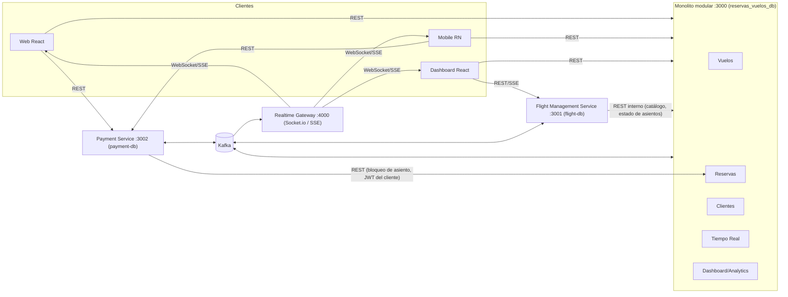
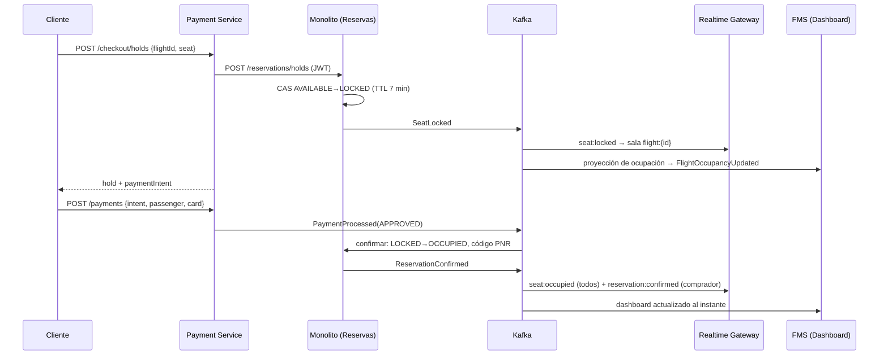
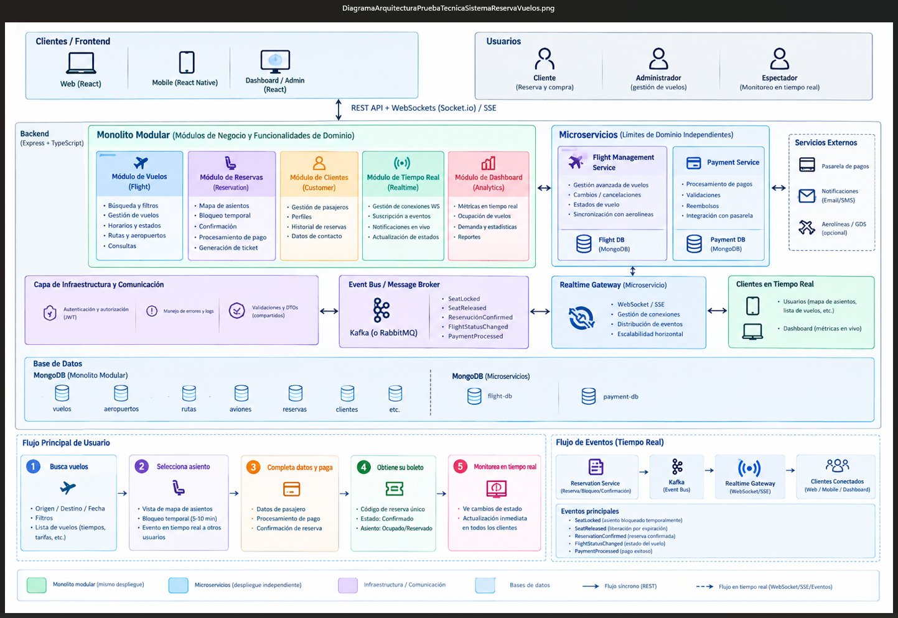

# Arquitectura

## Por qué un híbrido monolito modular + microservicios

| Decisión | Motivo |
|---|---|
| **Reservas, Vuelos, Clientes, Tiempo Real y Dashboard en un monolito modular** | El bloqueo y la confirmación de asientos son la operación crítica de concurrencia. Tenerlos junto al inventario de vuelos en una sola base de datos permite garantizar la ausencia de *double booking* con operaciones atómicas, sin transacciones distribuidas ni 2PC. Además simplifica el despliegue y la depuración. |
| **Módulos con fronteras explícitas (puertos)** | Cada módulo expone casos de uso y consume a otros solo mediante interfaces (`SeatAvailabilityPort`, `CustomerRegistryPort`, `FlightReaderPort`). Por eso se puede extraer un módulo a microservicio cambiando solo el adaptador. |
| **Flight Management Service como microservicio** | La operación de vuelos (retrasos, cancelaciones, feeds de aerolíneas/GDS) y el dashboard tienen otro ritmo de cambio y otros usuarios (operaciones). Su proyección de ocupación es un *read model* alimentado por eventos (CQRS). |
| **Payment Service como microservicio** | Aísla datos sensibles y la integración con la pasarela; se puede auditar, desplegar y escalar por separado. |
| **Realtime Gateway como microservicio** | Las conexiones WebSocket son de larga duración y escalan distinto que la API; separarlas evita que picos de conexiones afecten al negocio. |
| **Kafka como Event Bus** | Desacopla a productores de consumidores, garantiza orden por vuelo (clave de partición `flightId`), permite reintentos y *replay*, y reparte los eventos a varios consumidores. |
| **shared-kernel + cliente/shared** | Evitan duplicar código (DRY). `cliente/shared` contiene los contratos (DTOs, eventos, validaciones, reglas) entre frontend y backend. `backend/shared-kernel` contiene la infraestructura técnica común (JWT, manejo de errores, logs, SSE, Kafka, fábrica de Express, ciclo de vida del proceso). Ninguno contiene lógica de negocio de un servicio, así que no hay acoplamiento de dominio. |

## Principios SOLID aplicados

- **S (una sola responsabilidad):** un caso de uso por clase (`CreateSeatHoldUseCase`, `ConfirmReservationUseCase`, `ProcessPaymentUseCase`...). Los controladores solo validan y delegan; los repositorios solo persisten.
- **O (abierto/cerrado):** para añadir un transporte o una persistencia se crea un adaptador nuevo sin tocar los casos de uso. Por ejemplo, `InMemoryEventBus` y `KafkaEventBus` implementan el mismo `EventBus`.
- **L (sustitución de Liskov):** los adaptadores en memoria y los de Mongo/Kafka son intercambiables. Las pruebas ejecutan los mismos casos de uso con unos u otros.
- **I (segregación de interfaces):** puertos pequeños y específicos (`SeatRepository`, `ReservationRepository`, `FlightCatalogClient`, `PaymentGateway`, `ReservationHoldClient`, `Clock`).
- **D (inversión de dependencias):** la aplicación depende de abstracciones, y el *composition root* (`container.ts`) inyecta las implementaciones.

## Manejo de errores

- Errores de dominio tipados (`NotFoundError`, `ConflictError`, `ValidationError`, `ForbiddenError`...) que un único `errorHandler` traduce a HTTP con un formato uniforme `{ success: false, error: { code, message, details } }`.
- Validación de entrada con esquemas Zod compartidos (422 con el detalle por campo).
- Los errores de negocio de un servicio remoto se propagan al cliente; por ejemplo, un 409 `SEAT_NOT_AVAILABLE` del monolito llega así a través del Payment Service.
- Handlers de Kafka con reintentos y *backoff*; tras agotarse se registran sin bloquear la partición.
- Compensaciones (saga) cuando un paso asíncrono falla. Registro de `unhandledRejection` y `uncaughtException`, y apagado ordenado.

## Vista general



## Arquitectura hexagonal

Cada módulo del monolito y cada microservicio se organiza en:

- `domain/` — entidades, reglas de negocio y **puertos** (interfaces de repositorios, clientes, bus de eventos).
- `application/` — casos de uso; solo dependen de los puertos.
- `infrastructure/` — **adaptadores**: HTTP (Express), persistencia (Mongoose y en memoria), mensajería (Kafka y en memoria), clientes HTTP, WebSocket.
- `container.ts` — composition root que conecta puertos y adaptadores.

Los adaptadores en memoria se usan en las pruebas; así se verifica el mismo código de aplicación sin MongoDB ni Kafka.

Los módulos del monolito se comunican entre sí mediante puertos (por ejemplo, Vuelos consume `SeatAvailabilityPort`
implementado por Reservas; Reservas consume `CustomerRegistryPort` implementado por Clientes).

## Eventos (Kafka)

Un tópico por evento; la clave de partición es el `flightId`, así se preserva el orden de los eventos de un mismo vuelo.

| Evento | Tópico | Productor | Consumidores |
|---|---|---|---|
| SeatLocked | `reservas.seat.locked` | Monolito (Reservas) | FMS (dashboard), Realtime Gateway |
| SeatReleased | `reservas.seat.released` | Monolito (expiración / cancelación / reembolso) | FMS, Payment (expira intención), RG |
| ReservationConfirmed | `reservas.reservation.confirmed` | Monolito | FMS, Payment (asocia código), RG |
| ReservationFailed | `reservas.reservation.failed` | Monolito | Payment (reembolso automático), RG |
| FlightStatusChanged | `reservas.flight.status-changed` | FMS | Monolito (búsqueda / libera bloqueos), Payment (reembolsa si se cancela), RG |
| PaymentProcessed | `reservas.payment.processed` | Payment | Monolito (confirma reserva), RG |
| PaymentRefunded | `reservas.payment.refunded` | Payment | Monolito (cancela reserva y libera asiento) |
| FlightOccupancyUpdated | `reservas.flight.occupancy-updated` | FMS | Realtime Gateway (`dashboard:occupancy`) |

Sobre común (`DomainEvent`): `eventId, type, version, source, occurredAt, key, payload`. Definido en `cliente/shared`.

## Anti double booking

1. Colección `asientos` con índice único `{flightId, seatNumber}`: un documento por asiento.
2. El bloqueo es un **compare-and-set atómico** (`findOneAndUpdate`) condicionado a `status = AVAILABLE` o a un bloqueo vencido.
   Dos solicitudes concurrentes nunca obtienen el mismo asiento (prueba con 25 solicitudes simultáneas).
3. La confirmación (`LOCKED → OCCUPIED`) solo procede si el bloqueo pertenece a la misma reserva.
4. La liberación por expiración se hace con un barrido reactivo (`RxJS interval + exhaustMap`), también condicional y seguro con varias réplicas.
5. En el Payment Service, la intención pasa `PENDING → PROCESSING` atómicamente, lo que evita un doble cobro, y existe un índice único de pago aprobado por reserva.
6. Saga con compensación: si el pago llega tarde y el asiento ya fue tomado, se emite `ReservationFailed` y el Payment Service reembolsa.

## Secuencia: bloqueo, pago y confirmación



## Tiempo real

- **Socket.io** (Realtime Gateway, puerto 4000). Salas: `flights:list`, `flight:{id}`, `dashboard:{id}`, `dashboard:all`, `reservation:{id}`, `user:{id}`.
- **SSE** como alternativa: `RG /api/v1/sse/...`, `FMS /api/v1/dashboard/.../stream`, `Monolito /api/v1/realtime/events`.
- **Escalabilidad horizontal:** cada réplica del gateway usa su propio consumer group de Kafka (`realtime-gateway-<instancia>`), recibe todos los eventos y los emite a sus sockets locales, sin necesidad de un adapter compartido. Para exponer varias réplicas se usa un balanceador con sticky sessions.

## Programación reactiva

- RxJS `Subject`/`Observable` como flujo de eventos de cada bus (`events$`).
- Handlers Kafka con reintento reactivo (`defer + retry` con backoff).
- Barrido de expiración de bloqueos con `interval + exhaustMap`.
- Proyección del dashboard y SSE como streams (`filter`, `map`, `scan`, `share`).
- Sincronización inicial del FMS con `retry` exponencial hasta que el monolito responde.


## Diagrama de Arquitectura:




## Justificación de la Arquitectura:

Se optó por un hibrido entre Monolito Modular y Microservicios ya que la operación area requiere de una aplicación central que permita de la gestión centralizada de la información de las entidades (Reservas, Vuelos, Clientes y de forma sincrona con gestión en la base de datos no distribuida sino centralizada mediante MongoDB y que cumpla con: Permite garantizar la ausencia de *double booking* con operaciones atómicas, sin transacciones distribuidas ni 2PC y garantizar el bloqueo de los asientos; además del uso de KAFKA + WebSockets). 

Los microservicios facilitan el proceso de pagos y reembolsos de las reservas de los vuelos, gestión avanzada de vuelos (Cambios, cancelaciones, estado de vuelo), sincronización con otras aerolíneas y Realtime Gateway para escalar el control del bloque de asientos y disponibilidad de las reservas de los vuelos.


## Manejo de Concurrencia y Estado en Tiempo Real:

### Desde el punto de vista técnico revisar estos apartados de de este documento actual:

- Eventos (Kafka).
- Anti double booking.
- Secuencia: bloqueo, pago y confirmación.
- Tiempo Real.

### Desde un enfoque funcional el manejo es el siguiente:

- Igresar al proyecto de Backend en Visual Studio Code y habiendo iniciado Docker Desktop.

```Powershell
cd C:\Users\USUARIO\Documents\PruebaTecnicaDavivienda\PruebaTecnicaSistemaReservasVuelosTiempoReal\frontend
npm install
Copy-Item .env.example .env
npm run dev
```

- Abre http://localhost:5173. Los cambios en el código se ven al instante.
- Para probar el tiempo real, usa dos ventanas: Abre la app en dos ventanas; puede ser una normal y otra de incógnito.
- Inicia sesión con cliente@skyandes.com / Cliente123* en una y con cliente2@skyandes.com / Cliente123* en la otra. Hay botones de "Usuarios de prueba" que llenan el formulario.
- En ambas busca el mismo vuelo (por ejemplo BOG → CTG para mañana) y abre el mapa de asientos.
- Selecciona un asiento en la ventana 1. En la ventana 2 aparece al instante como bloqueado (rayado ámbar); si intenta tomarlo, recibe el aviso de conflicto.
- En la ventana 1, pulsa "Continuar con el pago". Verás la cuenta regresiva del bloqueo.
- Paga con la tarjeta rechazada 4000 0000 0000 0002: debe mostrar el error y conservar el bloqueo.
- Luego paga con la aprobada 4111 1111 1111 1111: debe mostrar el boleto con el código de reserva, y en la ventana 2 el asiento pasa a ocupado.
- Si en vez de pagar dejas vencer la cuenta regresiva, el asiento se libera solo en ambas ventanas.
- Abre /dashboard con espectador@skyandes.com / Espectador123* para ver la ocupación y los eventos en vivo.
- Con admin@skyandes.com / Admin123*, en el monitor del vuelo cámbialo a Retrasado. La lista de resultados de las otras ventanas se actualiza sola.


## Decisiones Técnicas Clave:

Remitirse al archivo /decisiones-tecnicas.md