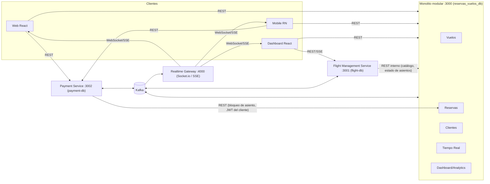
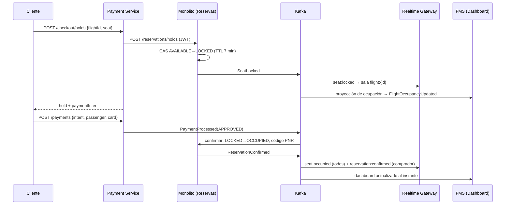

# Arquitectura

## Vista general

## Arquitectura hexagonal

Cada módulo del monolito y cada microservicio se organiza en:

- `domain/` — entidades, reglas de negocio y **puertos** (interfaces de repositorios, clientes, bus de eventos).
- `application/` — casos de uso; solo dependen de los puertos.
- `infrastructure/` — **adaptadores**: HTTP (Express), persistencia (Mongoose y en memoria), mensajería (Kafka y en memoria), clientes HTTP, WebSocket.
- `container.ts` — composition root que conecta puertos y adaptadores.

Los adaptadores en memoria se usan en las pruebas; así se verifica el mismo código de aplicación sin MongoDB ni Kafka.

Los módulos del monolito se comunican entre sí mediante puertos (por ejemplo, Vuelos consume `SeatAvailabilityPort`
implementado por Reservas; Reservas consume `CustomerRegistryPort` implementado por Clientes).

## Eventos (Kafka)

Un tópico por evento; la clave de partición es el `flightId`, así se preserva el orden de los eventos de un mismo vuelo.

| Evento | Tópico | Productor | Consumidores |
|---|---|---|---|
| SeatLocked | `reservas.seat.locked` | Monolito (Reservas) | FMS (dashboard), Realtime Gateway |
| SeatReleased | `reservas.seat.released` | Monolito (expiración / cancelación / reembolso) | FMS, Payment (expira intención), RG |
| ReservationConfirmed | `reservas.reservation.confirmed` | Monolito | FMS, Payment (asocia código), RG |
| ReservationFailed | `reservas.reservation.failed` | Monolito | Payment (reembolso automático), RG |
| FlightStatusChanged | `reservas.flight.status-changed` | FMS | Monolito (búsqueda / libera bloqueos), Payment (reembolsa si se cancela), RG |
| PaymentProcessed | `reservas.payment.processed` | Payment | Monolito (confirma reserva), RG |
| PaymentRefunded | `reservas.payment.refunded` | Payment | Monolito (cancela reserva y libera asiento) |
| FlightOccupancyUpdated | `reservas.flight.occupancy-updated` | FMS | Realtime Gateway (`dashboard:occupancy`) |

Sobre común (`DomainEvent`): `eventId, type, version, source, occurredAt, key, payload`. Definido en `cliente/shared`.

## Anti double booking

1. Colección `asientos` con índice único `{flightId, seatNumber}`: un documento por asiento.
2. El bloqueo es un **compare-and-set atómico** (`findOneAndUpdate`) condicionado a `status = AVAILABLE` o a un bloqueo vencido.
   Dos solicitudes concurrentes nunca obtienen el mismo asiento (prueba con 25 solicitudes simultáneas).
3. La confirmación (`LOCKED → OCCUPIED`) solo procede si el bloqueo pertenece a la misma reserva.
4. La liberación por expiración se hace con un barrido reactivo (`RxJS interval + exhaustMap`), también condicional y seguro con varias réplicas.
5. En el Payment Service, la intención pasa `PENDING → PROCESSING` atómicamente, lo que evita un doble cobro, y existe un índice único de pago aprobado por reserva.
6. Saga con compensación: si el pago llega tarde y el asiento ya fue tomado, se emite `ReservationFailed` y el Payment Service reembolsa.

## Secuencia: bloqueo, pago y confirmación

## Tiempo real

- **Socket.io** (Realtime Gateway, puerto 4000). Salas: `flights:list`, `flight:{id}`, `dashboard:{id}`, `dashboard:all`, `reservation:{id}`, `user:{id}`.
- **SSE** como alternativa: `RG /api/v1/sse/...`, `FMS /api/v1/dashboard/.../stream`, `Monolito /api/v1/realtime/events`.
- **Escalabilidad horizontal:** cada réplica del gateway usa su propio consumer group de Kafka (`realtime-gateway-<instancia>`), recibe todos los eventos y los emite a sus sockets locales, sin necesidad de un adapter compartido. Para exponer varias réplicas se usa un balanceador con sticky sessions.

## Programación reactiva

- RxJS `Subject`/`Observable` como flujo de eventos de cada bus (`events$`).
- Handlers Kafka con reintento reactivo (`defer + retry` con backoff).
- Barrido de expiración de bloqueos con `interval + exhaustMap`.
- Proyección del dashboard y SSE como streams (`filter`, `map`, `scan`, `share`).
- Sincronización inicial del FMS con `retry` exponencial hasta que el monolito responde.
