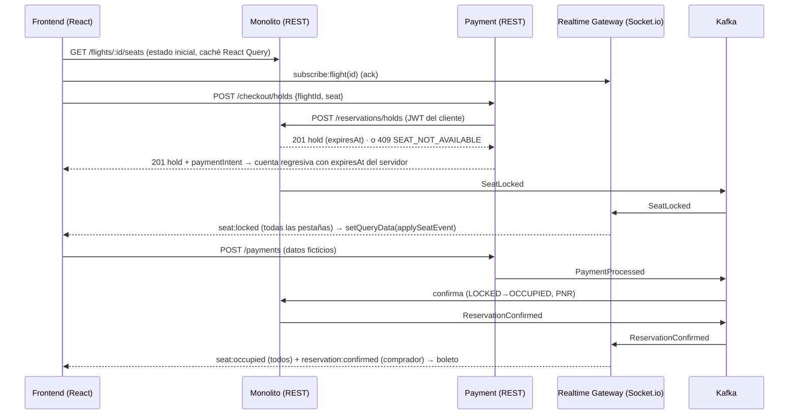

# Decisiones técnicas clave

Justificación de las librerías, los protocolos y las estrategias de persistencia y caché del backend, del frontend
y de la interacción entre ambos. Cada decisión indica qué se eligió, qué alternativas había, por qué se eligió y qué
costo implica.

---

## 1. Principio rector: una sola fuente de verdad por dato, tiempo real por eventos

El problema central es la concurrencia sobre un recurso escaso: el asiento. Todas las decisiones siguen tres reglas:

1. **El estado del asiento solo lo decide el servidor**, con una operación atómica en la base de datos. Ni el
   frontend ni ninguna caché intermedia pueden "adivinar" que un asiento está libre.
2. **Los comandos viajan por REST y los cambios de estado por eventos.** El cliente pide algo (bloquear, pagar) y
   recibe la respuesta. Los demás clientes se enteran por Kafka → Realtime Gateway → WebSocket.
3. **Consistencia fuerte donde se vende y eventual donde se muestra.** El bloqueo y la compra son estrictamente
   consistentes. El dashboard, los contadores de la búsqueda y los estados en Payment convergen en milisegundos
   mediante eventos.

| Dato | Consistencia | Mecanismo |
|---|---|---|
| Estado de un asiento (libre, bloqueado, ocupado) | **Fuerte** | Documento único con índice único y *compare-and-set* (`findOneAndUpdate` condicionado) |
| Reserva / boleto | **Fuerte** | Transiciones de estado condicionales (`PENDING_PAYMENT → CONFIRMED` solo desde estados válidos) |
| Cobro | **Fuerte** (sin doble cobro) | Intención `PENDING → PROCESSING` atómica + índice único parcial "un pago aprobado por reserva" |
| Disponibilidad en la búsqueda, dashboard, intenciones de pago | **Eventual** (ms) | Eventos Kafka + proyecciones idempotentes |

---

## 2. Lenguaje y contratos compartidos

| Decisión | Alternativas | Justificación | Costo |
|---|---|---|---|
| **TypeScript en todo el stack** (Node.js 22 + React 19) | JS plano; backend en Java/.NET | Un solo lenguaje permite compartir tipos y validaciones entre cliente y servidor; `strict` detecta errores de contrato en compilación | Paso de compilación en cada proyecto |
| **Paquete `cliente/shared`** con DTOs, catálogo de eventos, nombres de salas Socket.io, esquemas Zod y reglas de negocio | Duplicar interfaces; generar clientes desde OpenAPI | El frontend y los 4 backends usan **exactamente** los mismos contratos: si cambia un DTO o un evento, el compilador marca todos los consumidores. Las mismas validaciones (Luhn de la tarjeta, IATA, número de asiento) corren en el formulario y en la API | El frontend lo consume desde el código fuente (alias de Vite) y el backend como paquete local (`install-links`); requiere reinstalar al modificarlo |
| **`backend/shared-kernel`** (JWT, errores, validación, logs, Event Bus, fábrica Express, ciclo de vida) | Copiar el código en cada servicio; un framework (NestJS) | DRY sin acoplar dominios: solo contiene infraestructura técnica, nunca reglas de negocio de un servicio | Un paquete más que versionar |

---

## 3. Backend: librerías

| Librería | Uso | Por qué | Alternativas descartadas |
|---|---|---|---|
| **Express 4** | Adaptador HTTP de cada servicio | Estándar, mínimo y conocido. La arquitectura hexagonal deja a Express solo como adaptador de entrada, así que el framework no condiciona el dominio | **NestJS**: aporta DI y módulos, pero impone su estructura y decoradores; la inyección se resolvió con un *composition root* explícito (`container.ts`). **Fastify**: más rápido, pero el cuello de botella aquí es la BD y no el router |
| **Mongoose 8** | Adaptadores de persistencia | Esquemas, índices declarativos (`syncIndexes`) y `findOneAndUpdate` atómico, que es la base del anti double booking. Soporta *update pipelines* para la proyección del dashboard | Driver nativo (más verboso, sin gestión de índices); Prisma (su soporte de MongoDB no expone bien las actualizaciones atómicas condicionadas) |
| **KafkaJS** | Event Bus | Cliente Kafka 100 % JavaScript (sin binarios nativos), productor idempotente, *consumer groups*, admin para crear tópicos | `node-rdkafka` (más rendimiento, pero con compilación nativa que complica Docker/Windows) |
| **Socket.io 4** | Realtime Gateway | Salas (*rooms*) nativas para `flight:{id}`, `dashboard:{id}` o `reservation:{id}`; reconexión automática con *backoff*; *acks*; *fallback* a long-polling si un proxy bloquea WebSocket; middleware de autenticación en el *handshake* | `ws` nativo (habría que implementar salas, reconexión y heartbeats); SignalR/STOMP (ecosistemas .NET/Java) |
| **RxJS 7** | Programación reactiva | Modela los eventos como *streams*: `events$` de cada bus, barrido de expiración con `interval + exhaustMap` (sin solaparse), reintentos con `retry` y *backoff*, filtrado por sala para SSE, `scan` para estadísticas | `setInterval` y promesas manuales (más propenso a solapamientos y fugas) |
| **Zod** | Validación de entrada | Esquemas compartidos con el frontend, inferencia de tipos (`z.infer`), errores por campo (422) y validación de variables de entorno al arrancar (p. ej. `SEAT_LOCK_MINUTES` entre 5 y 10) | Joi o class-validator (no comparten tipos con el frontend) |
| **jsonwebtoken + bcryptjs** | Autenticación | JWT *stateless* verificable por los 4 servicios con el mismo secreto, sin sesión compartida; bcrypt para las contraseñas. `bcryptjs` es JS puro (sin binarios nativos) | Sesiones en servidor (requerirían un almacén compartido entre servicios) |
| **pino / pino-http** | Logs | Logs JSON estructurados de bajo costo, listos para agregadores (ELK, Loki). El log de acceso omite cabeceras (no expone tokens) | winston/morgan (más lentos, sin estructura por defecto) |
| **helmet, cors** | Seguridad HTTP | Cabeceras seguras por defecto; CORS configurable por entorno | — |
| **Jest + Supertest + socket.io-client** | Pruebas | Pruebas e2e con HTTP y WebSocket reales sobre adaptadores en memoria (posibles gracias a los puertos) | — |

---

## 4. Frontend: librerías

| Librería | Uso | Por qué | Alternativas descartadas |
|---|---|---|---|
| **React 19 + TypeScript** | UI | Pedido por la prueba; componentes y *hooks* encajan con estado que cambia por eventos | — |
| **Vite 7** | Build y desarrollo | Arranque y HMR instantáneos; alias para consumir `cliente/shared` desde el código fuente; *code splitting* (chunks `react` y `data`) | Create React App (obsoleto), Webpack (más lento y verboso) |
| **React Router 7** | Navegación | Rutas con **carga diferida** (`lazy`) por página y *error boundary* por ruta; guardas por rol (`RequireAuth`) | Next.js (el SSR no aporta valor: la app es 100 % autenticada y en tiempo real) |
| **TanStack Query 5** | Estado del servidor + caché | Caché por clave, `staleTime` por tipo de dato, reintentos, `refetchOnWindowFocus`, y sobre todo **actualización de la caché en sitio (`setQueryData`) al llegar un evento**, sin volver a pedir datos | Redux/RTK Query (más ceremonia); fetch + `useState` (sin caché ni invalidación) |
| **socket.io-client** | Tiempo real | Contraparte del gateway: salas, reconexión con *backoff* (1 a 8 s) y notificación de reconexión para re-sincronizar | `WebSocket` nativo (sin salas ni reconexión) |
| **EventSource (SSE)** | Tiempo real de respaldo | Si WebSocket está bloqueado (`VITE_REALTIME_TRANSPORT=sse`); reconecta solo (`retry: 3000` enviado por el backend) | Polling (más carga y latencia) |
| **Zod** (del paquete compartido) | Validación de formularios | Mismas reglas que el backend (tarjeta con Luhn y vencimiento, pasajero, búsqueda) | Validaciones duplicadas a mano |
| **Context API** | Estado de cliente | Solo para lo que no es del servidor: sesión y bloqueo activo (checkout) | Redux (innecesario con TanStack Query) |
| **Vitest + Testing Library** | Pruebas | Misma configuración que Vite; pruebas de dominio puro, hooks y componentes con dobles de los puertos | Jest (configuración duplicada con Vite) |
| **nginx** (imagen Docker) | Servir la SPA | Estático, liviano, con *fallback* a `index.html` para las rutas del cliente | Servir desde Node (más pesado, sin necesidad) |

---

## 5. Protocolos de comunicación

| Tramo | Protocolo | Justificación |
|---|---|---|
| Frontend → servicios (comandos y consultas) | **REST/JSON sobre HTTP** con sobre uniforme `{ success, data, meta }` / `{ success:false, error:{ code, message, details } }` | Simple, cacheable, fácil de probar (`requests.http`, script PowerShell). Los códigos de error de negocio (`SEAT_NOT_AVAILABLE`, `HOLD_EXPIRED`...) se traducen en mensajes de UI concretos |
| Servidor → frontend (cambios en vivo) | **WebSocket (Socket.io)** por salas; **SSE** como respaldo | Bidireccional para suscribirse y dessuscribirse de salas con *ack*. SSE es unidireccional pero atraviesa proxies HTTP sin configuración. El frontend comparte un registro de suscriptores con conteo de referencias por sala para ambos transportes |
| Entre servicios, asíncrono | **Kafka** (un tópico por evento, clave de partición = `flightId`) | **Orden garantizado por vuelo** (todos los eventos de un vuelo en la misma partición), *replay* y reintentos, y ***fan-out***: cada consumidor (monolito, FMS, Payment, cada réplica del gateway) tiene su *consumer group* y recibe todo. El diagrama admitía RabbitMQ: se eligió Kafka por el orden por clave y la retención, que permite reconstruir proyecciones |
| Entre servicios, síncrono | **REST** (Payment → monolito para bloquear reenviando el JWT del cliente; FMS → monolito `/internal/*` con `x-internal-api-key`) | El bloqueo necesita **respuesta inmediata** (¿obtuve el asiento o no?), y eso no se puede hacer por eventos. La sincronización inicial del catálogo es una consulta puntual |
| Autenticación | **JWT Bearer** compartido por los 4 servicios; en WebSocket, `auth.token` en el *handshake* | Sin estado en servidor; cada servicio valida el token localmente |

**Contrato de eventos:** sobre común `DomainEvent { eventId, type, version, source, occurredAt, key, payload }`, definido en
`cliente/shared`. Los consumidores son **idempotentes**: la proyección del dashboard guarda el estado por asiento y una
confirmación repetida con el mismo `paymentId` se ignora. Por eso la entrega "al menos una vez" de Kafka no genera
inconsistencias, y los servicios nuevos pueden leer los tópicos desde el inicio (`fromBeginning`).

---

## 6. Persistencia

### 6.1 MongoDB, una base por servicio (*database per service*)

| Base | Dueño | Colecciones |
|---|---|---|
| `reservas_vuelos_db` | Monolito modular | vuelos, aeropuertos, rutas, aviones, **asientos**, reservas, clientes, usuarios |
| `flight-db` | Flight Management Service | vuelos_gestion, ocupacion_vuelos, historial_estados, sincronizaciones |
| `payment-db` | Payment Service | intenciones_pago, pagos, reembolsos |

**¿Por qué MongoDB?** Pedido por el stack de la prueba y adecuado al problema:

- **Atomicidad a nivel de documento.** Si cada asiento es un documento, un `findOneAndUpdate` condicionado es un
  *compare-and-set* atómico, sin transacciones multi-documento ni *replica set*.
- **Modelo documental natural** para vuelos con tarifas embebidas, pasajero embebido en la reserva y proyecciones
  con un mapa de asientos.
- **Índices** únicos y parciales (código de reserva único, un pago aprobado por reserva) y agregaciones para
  disponibilidad y reportes.

### 6.2 Decisiones de modelado

| Decisión | Alternativa | Justificación |
|---|---|---|
| **Un documento por asiento** (`asientos`, índice único `{flightId, seatNumber}`) | Arreglo de asientos embebido en el vuelo | Con el arreglo embebido, todos los usuarios de un vuelo competirían por el mismo documento (contención y documento "caliente"). Con documentos separados, la concurrencia es por asiento y el índice único impide duplicados físicamente |
| **Bloqueo = campos en el asiento** (`status`, `lockedByReservationId`, `lockExpiresAt`) + reserva `PENDING_PAYMENT` | Colección de bloqueos aparte; índice TTL de MongoDB | Un solo documento decide la verdad (sin carreras entre dos colecciones). Se descartó el TTL de Mongo porque borra con hasta ~60 s de retraso y **no emite eventos**; el barrido propio (cada 5 s) libera y publica `SeatReleased` |
| **Bloqueo vencido = disponible en lectura** (`effectiveSeatStatus`) | Esperar al barrido | Nadie ve un asiento "bloqueado" que ya expiró, aunque el barrido no haya pasado aún. `tryLock` también acepta bloqueos vencidos |
| **Transiciones de estado condicionales** en reservas, pagos y vuelos | Leer, modificar y guardar | Evitan carreras sin *locks*: la actualización solo aplica si el estado actual es el esperado |
| **Sin transacciones distribuidas: saga con compensación** | 2PC / transacciones multi-documento | Si el pago llega cuando el asiento ya no es del cliente, el monolito emite `ReservationFailed` y Payment reembolsa automáticamente |
| **Proyección de ocupación en el FMS** con el estado de cada asiento (CQRS) | Consultar al monolito en cada petición del dashboard | El dashboard lee de su propia base (sin cargar al monolito) y la aplicación de eventos es idempotente. Se inicializa perezosamente desde el monolito |
| **Carga inicial determinista** (semilla fija, fechas relativas al día de despliegue) + script `mongo-init` con validadores `$jsonSchema` | Datos fijos | Siempre hay vuelos "de mañana" para probar; la validación en la BD es una segunda defensa además de Zod |

---

## 7. Estrategia de caché

### 7.1 Backend: sin caché distribuida, de forma deliberada

**No se usa Redis ni caché en memoria para el estado de los asientos.** Una caché de disponibilidad podría mostrar un
asiento libre que ya se vendió, y eso es justo el problema que la prueba pide evitar. En su lugar:

| Necesidad | Solución | Por qué no una caché |
|---|---|---|
| Disponibilidad al buscar | Agregación sobre `asientos` con índice `{flightId, status}` | Es barata con índice y siempre exacta |
| Dashboard en vivo | **Proyección `ocupacion_vuelos`** en el FMS, actualizada por eventos | Funciona como caché de lectura, pero **invalidada por eventos** y no por tiempo: nunca queda "vieja" más que la latencia de Kafka |
| Escalar el Realtime Gateway | Cada réplica consume todos los eventos (su propio *consumer group*) | Evita el adapter de Redis de Socket.io; Kafka ya reparte los eventos |
| Idempotencia de eventos | Estado guardado en la proyección y en las transiciones | No se necesita una caché de `eventId` procesados |

**Cuándo se agregaría Redis:** para *rate limiting* por IP/usuario, para cachear el catálogo (aeropuertos y rutas)
con alto tráfico, o si se quisiera balancear el gateway sin *sticky sessions* (adapter de Redis para Socket.io).

### 7.2 Frontend: TanStack Query como caché del estado del servidor

| Dato | `staleTime` | Cómo se mantiene al día |
|---|---|---|
| Catálogo (aeropuertos, rutas, aviones) | 1 hora | Cambia muy poco |
| Resultados de búsqueda | 30 s | Eventos `flight:status-changed` y `dashboard:occupancy` actualizan la caché en sitio (`setQueryData`) |
| Mapa de asientos | 60 s | Eventos `seat:locked`, `seat:released` y `seat:occupied` aplicados con **funciones puras del dominio** (`applySeatEvent`) sobre la caché |
| Dashboard / ocupación | — | SSE del FMS + WebSocket del gateway actualizan la caché |
| Confirmación de la reserva | *polling* cada 2 s **solo mientras se espera** | Respaldo del evento `reservation:confirmed` por si el cliente se reconecta en ese momento |

Reglas transversales:

- **Re-sincronización al reconectar.** Si el WebSocket se cae y vuelve, se invalidan todas las consultas
  (`invalidateQueries`), porque durante la desconexión pudieron perderse eventos.
- `refetchOnWindowFocus` al volver a la pestaña.
- **Reintentos solo en errores de red o 5xx.** Un 4xx (p. ej. 409 asiento tomado) nunca se reintenta, y las
  **mutaciones no se reintentan** para no bloquear ni cobrar dos veces. El backend además es idempotente: un
  bloqueo repetido devuelve el mismo, y un pago concurrente devuelve 409 `PAYMENT_IN_PROGRESS`.
- **Sin actualización optimista del asiento.** La UI espera el 201 del bloqueo, porque el servidor es la autoridad.
  Ante un 409 se re-sincroniza el mapa.
- **Sesión en `sessionStorage`** (por pestaña): permite probar dos usuarios en dos pestañas. Se descarta la sesión si
  el `exp` del JWT venció, y un 401 cierra la sesión.
  - *Costo:* un token en storage es accesible si hubiera XSS. Una versión productiva usaría una cookie `httpOnly`
    con *refresh token*.

---

## 8. Interacción frontend ↔ backend (de punta a punta)

1. **Estado inicial por REST y luego deltas por eventos.** Toda vista en vivo (búsqueda, mapa, dashboard) carga una
   foto por REST y aplica eventos incrementales. Al reconectar, vuelve a tomar la foto.
2. **La cuenta regresiva usa el `expiresAt` del servidor**, no un temporizador local arbitrario. Si expira, el
   backend emite `SeatReleased(EXPIRED)` y todas las pestañas liberan el asiento.
3. **La confirmación es asíncrona.** El pago responde en cuanto la pasarela aprueba, y el boleto llega por evento
   (con *polling* de respaldo). Así el Payment Service no depende de que el monolito esté disponible en ese instante.
4. **Errores homogéneos.** El sobre `{ success:false, error:{ code } }` se normaliza en `AppError`, y la UI muestra
   mensajes por código de negocio.
5. **Configuración por entorno.** Las URLs (`VITE_*`) se resuelven al construir, porque las usa el navegador. El
   backend acepta el origen del frontend por CORS.
6. **Privacidad en tiempo real.** Los eventos que llegan al navegador no incluyen datos del pasajero ni de la
   tarjeta (el gateway los filtra), y la sala de una reserva exige un JWT.

---

## 9. Límites conocidos y evolución

| Tema | Estado actual | Evolución propuesta |
|---|---|---|
| Publicación de eventos | Se publica en Kafka justo después de escribir en MongoDB, con reintentos | **Transactional outbox** (colección `outbox` + publicador) para garantizar que ningún evento se pierda si Kafka falla entre la escritura y la publicación |
| Sesión del frontend | JWT en `sessionStorage` | Cookie `httpOnly` + *refresh token* |
| Escalado del gateway | Réplicas con *sticky sessions* | Adapter de Redis si se requiere balanceo sin afinidad |
| Documentación de la API | Markdown + `requests.http` | OpenAPI/Swagger generado desde los esquemas Zod |
| Observabilidad | Logs estructurados | Trazas distribuidas (OpenTelemetry) propagando el `eventId` |
