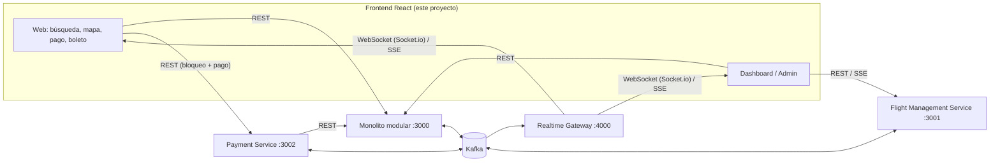

# Revisión de cumplimiento del diagrama de arquitectura (frontend)

Referencia: [`arquitectura/DiagramaArquitecturaPruebaTecnicaSistemaReservaVuelos.png`](../../arquitectura/DiagramaArquitecturaPruebaTecnicaSistemaReservaVuelos.png).

## Flujo del cliente según el diagrama

## Reglas verificadas

| # | Regla del diagrama | Cómo se cumple en el frontend | Estado |
|---|---|---|---|
| 1 | Clientes **Web (React)** y **Dashboard/Admin (React)** | Una SPA con dos áreas: flujo de compra (`/`, `/flights/:id`, `/checkout`, boletos) y monitoreo/gestión (`/dashboard`, `/admin`). Carga diferida por ruta. | ✅ |
| 2 | Usuarios: **Cliente** (reserva y compra), **Administrador** (gestión de vuelos), **Espectador** (monitoreo en tiempo real) | `RequireAuth` por rol: compra solo `CUSTOMER`/`ADMIN`; cambio de estado de vuelos y `/admin` solo `ADMIN`; el espectador ve mapas y dashboard en modo lectura. El backend vuelve a validar cada rol. | ✅ |
| 3 | Comunicación **REST API + WebSockets (Socket.io) + SSE** | REST con `HttpClient`; Socket.io con `SocketRealtimeClient`; SSE para el dashboard del FMS y como transporte alterno completo (`VITE_REALTIME_TRANSPORT=sse`). | ✅ |
| 4 | El navegador **no** habla con Kafka: **Reservation Service → Kafka → Realtime Gateway → Clientes** | Ningún adaptador conoce Kafka; los eventos llegan solo desde el gateway (o SSE de respaldo). | ✅ |
| 5 | Los **microservicios** tienen límites de dominio independientes | Un puerto y un adaptador por servicio: `CheckoutGateway` → Payment Service, `FlightManagementGateway` → FMS; los módulos del monolito tienen su propio puerto (Vuelos, Reservas, Clientes, Analytics). | ✅ |
| 6 | El **bloqueo temporal** lo gestiona el Payment Service invocando al Módulo de Reservas | Bloqueo y liberación solo por `POST`/`DELETE /checkout/holds` (Payment Service). El puerto `ReservationGateway` del frontend es de solo lectura: no expone `/reservations/holds`. | ✅ |
| 7 | **Flujo principal de usuario** (1 busca → 2 selecciona → 3 datos y pago → 4 boleto → 5 monitorea) | `FlowStepper` y navegación guiada; desde el boleto se abre el monitor del vuelo (paso 5). | ✅ |
| 8 | **Eventos principales** `SeatLocked`, `SeatReleased`, `ReservationConfirmed`, `FlightStatusChanged`, `PaymentProcessed` | Consumidos como `seat:locked`, `seat:released`, `seat:occupied`/`reservation:confirmed`, `flight:status-changed`, `payment:processed`; además `dashboard:occupancy` (FlightOccupancyUpdated). | ✅ |
| 9 | Bloqueo temporal **5-10 min** con liberación por expiración | Temporizador con la fecha `expiresAt` del servidor; la liberación real llega como `SeatReleased` (barrido del backend). Respaldo local si el evento no llega. | ✅ |
| 10 | Reserva confirmada = asiento **Ocupado/Reservado** permanente y deshabilitado para todos | `applySeatEvent`: `OCCUPIED` no se revierte por eventos tardíos (`SeatLocked`, `SeatReleased` por expiración). Solo lo libera un `SeatReleased` con motivo `PAYMENT_REFUNDED` o `FLIGHT_CANCELLED`, que es lo que publica el backend. Un `SeatReleased` de una reserva anterior tampoco libera un bloqueo nuevo del mismo asiento. | ✅ |
| 10b | El **tiempo de bloqueo** es configurable en el backend (`SEAT_LOCK_MINUTES`, 5-10) | El temporizador calcula la duración con las fechas del propio bloqueo (`paymentIntent.createdAt` → `hold.expiresAt`), sin valores fijos. | ✅ |
| 11 | **Capa de infraestructura**: autenticación JWT, manejo de errores y logs, validaciones y DTOs compartidos | `SessionManager` (JWT, expiración, 401), `AppError` + mensajes de negocio + *error boundary*, esquemas Zod y DTOs de `cliente/shared`. | ✅ |
| 12 | **Realtime Gateway**: gestión de conexiones, distribución de eventos, escalabilidad horizontal | Una conexión por pestaña, salas con conteo de referencias, re-suscripción automática y re-sincronización REST tras reconectar (compatible con varias réplicas detrás de sticky sessions). Si el servidor cierra la conexión se reconecta explícitamente; si rechaza un JWT vencido, sigue como invitado, y la sesión se cierra sola al vencer el token. | ✅ |
| 13 | **Clientes en tiempo real**: usuarios (mapa de asientos, lista de vuelos) y dashboard (métricas en vivo) | Mapa (`flight:{id}`), lista de resultados (`flights:list`), dashboard global (`flights:list` + SSE FMS) y monitor por vuelo (`dashboard:{id}` + SSE FMS). | ✅ |
| 14 | **Mobile (React Native)** | Fuera del alcance de esta entrega. Los puertos, el dominio y los hooks de `application/` no dependen del DOM y pueden reutilizarse. | ➖ |

## Observaciones sobre el backend (recomendaciones)

1. **Datos de otros usuarios en el SSE público del monolito.** `GET /api/v1/realtime/events` no exige autenticación
   y reenvía el sobre completo de los eventos de dominio (`PaymentProcessed` incluye `passenger`; `ReservationConfirmed`
   incluye `reservationCode` y `userId`). El Realtime Gateway sí filtra por sala y elimina `passenger`. **El frontend ya
   no consume ese stream**. Recomendación: protegerlo con `x-internal-api-key` o JWT de administrador.
2. **SSE sin canal de reservas en el gateway.** El gateway expone SSE para vuelos y dashboard, pero no para
   `reservation:{id}`. Con el transporte SSE, la confirmación del pago se detecta con la consulta REST periódica de la
   reserva (cada 2 s) y con `seat:occupied` en la sala del vuelo. Recomendación: añadir `/sse/reservations/:id` con
   token de corta duración.
3. **`EventSource` no permite cabeceras.** Los streams SSE son de lectura pública; cualquier stream con datos de un
   usuario debería aceptar un token de corta duración por *query string* o usar cookies.
4. **Reporte general en memoria.** Con los adaptadores en memoria, `GET /analytics/reports/summary` devuelve
   `totalFlights = 0`; con MongoDB el valor es correcto.

## Verificación de punta a punta

Con los 4 servicios del backend levantados (adaptadores en memoria, `SEAT_LOCK_MINUTES` reducido para la prueba) y
el frontend en Vite, un script de Playwright con **dos navegadores independientes** (cliente y cliente2), un
espectador sin sesión y un administrador comprobó:

| Verificación | Resultado |
|---|---|
| HU2: el bloqueo de A aparece en el navegador de B | ✅ ~0,4 s |
| HU2: B no puede seleccionar el asiento bloqueado; A lo ve como "Bloqueado por usted" con temporizador | ✅ |
| HU4: el monitor del espectador registra el evento | ✅ |
| HU3: pago aprobado → boleto con código único | ✅ ~0,4 s |
| HU3: el asiento pasa a "Ocupado" en el navegador de B | ✅ |
| Liberación por expiración (`SeatReleased`) propagada y aviso al dueño del bloqueo | ✅ |
| HU1: `PATCH /flights/:id/status` (FMS) → la lista de resultados muestra "Retrasado" sin recargar | ✅ ~0,1 s |
| HU4: el dashboard reacciona al bloqueo | ✅ |
| Responsive: sin scroll horizontal a 390 px | ✅ |

